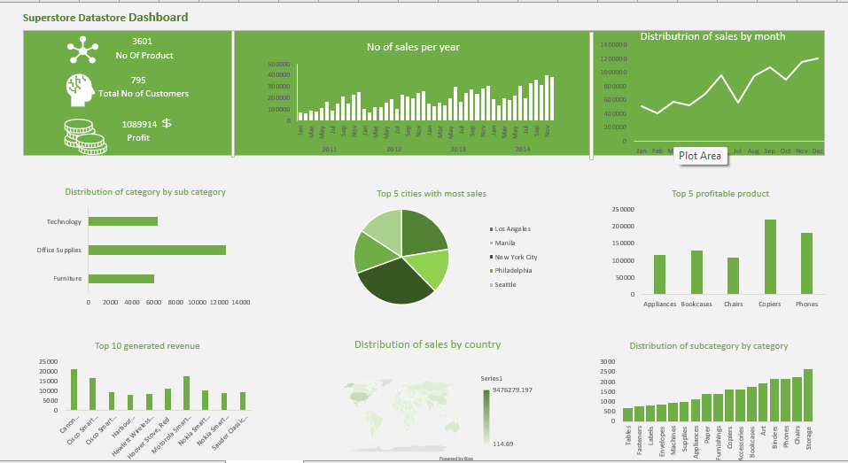

# SUPERSTORES-DATA-ANALYSIS
Superstore is a sales record detailing the categories, shipping records, products, sales, profits, and discounts. the items are categorized under Technology, office supplies and furniture with  about 17 sub-categories with details of shipping to over 500 cities and various  Regions such as Eastern Asia.
## Data used
The data is a superstore data that is gotten from Kaggle
## Key measures
1. 306 number of product
2. 795 total customer
3. $ 1089144 total profit
## Insight
1. coplers has the highest profitable product
2. Newyork city has the most sales
3. The month of November has the highest sales
 ## Tool used
 #### Microsoft Excel
 1. Administered Vlookup to join two separate spreadsheet
 2. pivot table for analysis and visualization
 3. 
